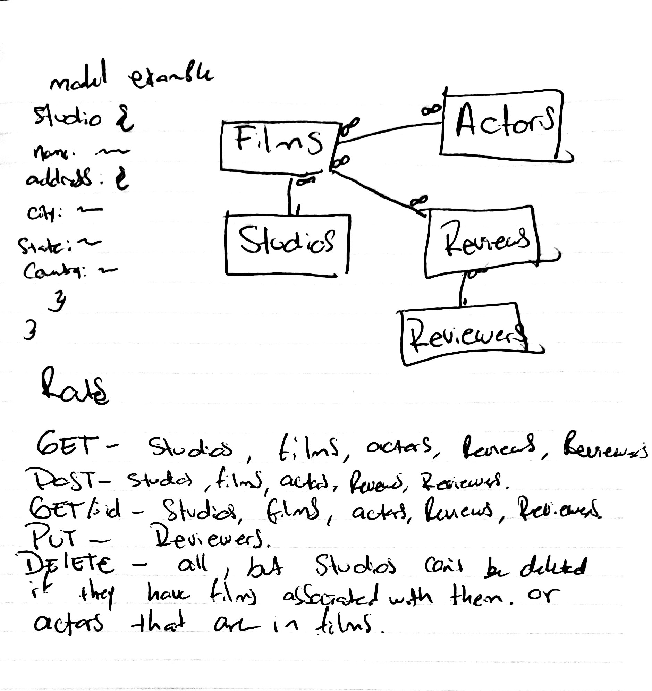

# ripe-banana

## Data Modeling

### Author: Antonella Gutierrez

### Links and Resources
* [submission PR](https://github.com/antonella-401-advanced-javascript/lab-07/pull/1)
* [travis](https://travis-ci.com/antonella-401-advanced-javascript/lab-07/builds/129189284)
* [back-end](https://lab-07-dogs.herokuapp.com/)

###  API Server
* routing
	* method based functions (`app.get`)
	* response.send and response.json
	* order
	* parameters (route and query)
		* request
	* `app.use()`
* project structure
	* views, routes
	* express generator
	* `express.Router()`

### Ripe-Banana
Models (Entities/Resources)
* Studio
* Film
* Actor
* Reviewer
* Review

### Middleware
* Parameters
* Route handling
  * Router object
* Middleware error handling

### Setup
#### .env requirements
* MONGODB_URI - mongodb://localhost:27017/ripe-banana
* PORT - 3000
#### Running the app
* npm start
* npm start:watch
#### Tests
* Unit Tests: npm test
* Lint Tests: npm run lint
#### UML
